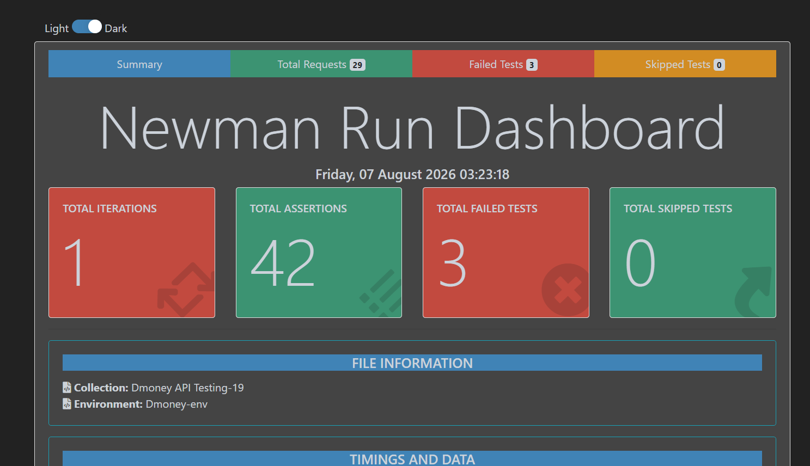

# Dmoney API Testing Automation


## Project Overview

This project contains end-to-end API testing automation for the **Dmoney Transaction System**, built using **Postman** and executed via **Newman**. The collection validates the complete transaction lifecycle — user creation, account activation, deposits, money transfer, cash out, merchant payment, authentication, and negative/edge-case scenarios.

The goal of this project is to ensure **API reliability, security, and data validation** through fully automated, repeatable test execution rather than manual verification.

---

## Technologies Used

| Tool | Purpose |
|---|---|
| **Postman** | API request design, scripting, and collection management |
| **Newman** | CLI-based collection runner for automated execution |
| **Newman HTML Extra Reporter** | Rich, visual HTML test reports |
| **JavaScript** | Pre-request scripts and test assertions |
| **Node.js** | Runtime environment for Newman and reporter packages |

---

## Test Case Documentation

Full test case specifications (steps, preconditions, expected results, priority) are maintained separately for traceability:

**Test Case Sheet:** [View on Google Drive](https://docs.google.com/spreadsheets/d/1jds95LkQRZj_UClbyewRdJ61vLOhNhlo/edit?usp=drive_link)

**API Documentation (Postman):** [View Documentation](https://documenter.getpostman.com/view/49738123/2sBY4VKd9b)

---

## Test Case Summary

A total of **30 test cases** were designed, covering both happy-path and negative/validation scenarios across the full customer, agent, and merchant transaction flow.

### ✅ Positive Test Cases (25)

| # | Test Case |
|---|---|
| 1 | Admin Login with Valid Credentials |
| 2 | Create Customer-1 |
| 3 | Create Customer-2 |
| 4 | Create Agent |
| 5 | Create Merchant |
| 6 | Activate Customer-1 |
| 7 | Activate Customer-2 |
| 8 | Activate Agent |
| 9 | Activate Merchant |
| 10 | System Login |
| 11 | System Deposit to Agent |
| 12 | Agent Login |
| 13 | Search Agent by ID |
| 14 | Verify Agent OTP |
| 15 | Agent Deposit to Customer |
| 16 | Customer-1 Login |
| 17 | Search Customer-1 |
| 18 | Verify Customer-1 OTP |
| 19 | Send Money (Customer-1 → Customer-2) |
| 20 | Customer-2 Login |
| 21 | Search Customer-2 |
| 22 | Verify Customer-2 OTP |
| 23 | Cash Out |
| 24 | Merchant Payment |
| 25 | Token Validation |

### ❌ Negative Test Cases (5)

| # | Test Case | Expected Behavior |
|---|---|---|
| 26 | Admin Login With Wrong Password | Returns `401 Unauthorized` |
| 27 | Create User Without NID | Fails with validation error |
| 28 | Deposit Negative Amount | Transaction rejected with validation message |
| 29 | Send Money More Than Available Balance | Fails due to insufficient balance / limit validation |
| 30 | Payment Without Token | Returns `401 Unauthorized`, access denied |

---

## Newman Test Execution Report

The collection was executed using the `htmlextra` reporter, producing a visual dashboard summarizing run results.

### Run Summary — *Friday, 07 August 2026, 03:23:18*

| Metric | Value |
|---|---|
| **Collection** | Dmoney API Testing-19 |
| **Environment** | Dmoney-env |
| **Total Iterations** | 1 |
| **Total Requests** | 29 |
| **Total Assertions** | 42 |
| **Failed Tests** | 3 |
| **Skipped Tests** | 0 |

> ⚠️ **Note:** 3 assertion failures were recorded in this run. These are being investigated and will be resolved in the next iteration of the collection. See [Known Issues](#known-issues) below.

### Report Screenshot



*(Full interactive HTML report available at `./Reports/Dmoney-Report.html` after running the collection locally.)*

---

## Known Issues

- 3 out of 42 assertions are currently failing in the latest run.
- Root cause analysis in progress — likely related to environment variable chaining (OTP/token expiry) between dependent requests.
- Tracked for fix in the next collection revision.

---

## Collection Execution

### 1. Install Newman

```bash
npm install -g newman
```

### 2. Install HTML Extra Reporter

```bash
npm install -g newman-reporter-htmlextra
```

### 3. Run the Collection

```bash
newman run "Dmoney API Testing-19.postman_collection.json" -e "Dmoney-env.postman_environment.json"
```

### 4. Generate HTML Report

```bash
newman run "Dmoney API Testing-19.postman_collection.json" -e "Dmoney-env.postman_environment.json" --reporters htmlextra --reporter-htmlextra-export "./Reports/Dmoney-Report.html"
```

---

## Project Structure

```text
D-MONEY
│
├── Reports
│   ├── Dmoney-Report.html
│   └── newman-report.png
│
├── Dmoney API Testing-19.postman_collection.json
├── Dmoney-env.postman_environment.json
├── README.md
└── .gitignore
```

---

## .gitignore

```gitignore
node_modules/
Reports/
.env
```

---

## Author

**MD. Ebnul Ahsan**
Batch: 19
Course: Road to SDET

---

## Outcome

Successfully automated and validated the Dmoney API workflow using Postman and Newman, covering 30 test cases across positive and negative scenarios. The suite includes 42 automated assertions across 29 requests, with structured reporting via Newman HTML Extra for continuous visibility into API health and regression status.
